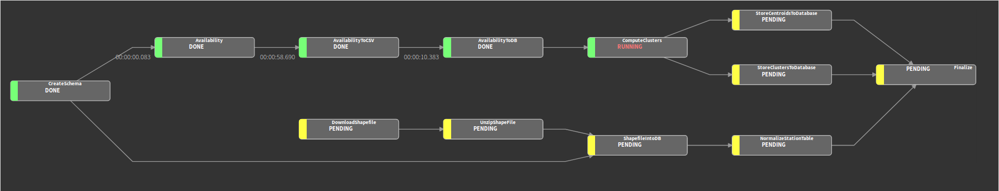

# Extraction, analysis and dataviz on open geospatial datasets

## Introduction

+ Who I am (who we are!)
+ Who you are
+ Workshop content and schedule
+ Disclaimer : sandbox project!

```
Since a few years, open data portals have become more and more popular, allowing experienced users to download and exploit a wide range of datasets, among which georeferenced ones.

This workshop will demystify the exploitation of such data, by illustrating typical treatments with a concrete example, *e.g.* analyse a bike-sharing system in a given city:
- extract data from open data portals and put it into a database
- product new information through machine learning techniques
- display data with a public API and visualize it with a web application

All these steps will be realised with a lot of Python and a few Javascript, without forgetting PostgreSQL and its PostGIS extension to store georeferenced data.

The workshop is intended for intermediate users, with basic knowledge in Data Science and Python/Javascript. Live coding (through Jupyter Notebooks) will take up the major part of the workshop, and interns will be encouraged to handle data.
```

## Outline

+ Installation
+ Data retrieving
+ Data storage
+ A little piece of Machine Learning
+ Break
+ Build a data pipeline with Luigi
+ Design access points to database
+ Visualize data through a web application
+ Play with the app!

## Installation

*Duration: 15' (9h15-9h30)*

What we need:
+ The project! Go to
the [Github repo](https://github.com/Oslandia/workshop-jitenshea)!
+ `Postgres`/`PostGIS` (handling the data!)
+ `yarn` (javascript dependency management)

The main external Python libraries that we will use:
+ SQLAlchemy
+ pandas
+ scikit-learn
+ Luigi
+ Flask

## Data retrieving

*Duration: 10' (9h30-9h40)*

Go to the Lyon Open
Data [portal](https://download.data.grandlyon.com/catalogue/srv/eng/catalog.search#/home) in order to explore the dataset.

Type "velov" in the search bar (name of the bike-sharing system in Lyon)...

Results in french (oops!)...

What can be important:
+ [stations](https://download.data.grandlyon.com/catalogue/srv/eng/catalog.search#/metadata/56a61ec4-8ce7-46ab-bdc4-3365e2d95635)
+ [real-time bike availability](https://download.data.grandlyon.com/catalogue/srv/eng/catalog.search#/metadata/46eac9e4-33cb-45b7-a104-7bcc8e654c98)
+ [bike availability history](https://download.data.grandlyon.com/catalogue/srv/eng/catalog.search#/metadata/9bc6806d-e8a0-463b-aaa1-4364a75e44d7)

Test the different data formats (`json`, `shp`, ...).

## Data storage

*Duration: 20' (9h40-10h)*

Gather all data sources into one single place: your database!

`.json` / `.shp` / `.xml` -> `.csv` -> `DB`

How about the database scheme? Consider the raw data scheme or generalize the
model?

As a result, we target a small database with:
+ shared-bike stations (station id, station name, stand number, geometry)
+ bike availability timeseries (timestamp, station id, available bikes)

## A little piece of Machine Learning

*Duration: 40' (10h-10h40)*

Answer a simple question about our data: **can we build groups of similar
shared-bike stations?**

We do not have any idea of such a representation -> unsupervised learning
(k-means clustering)

Other use cases are possible!

## Build a data pipeline with Luigi

*Duration: 30' (10h40-11h10)*

We did a lot of operations in previous phases. Each of them can fail... :(

Managing this workflow and task dependencies should enhance the data pipeline
quality.

Here comes `Luigi`!


... (ahem)


## Break

*Duration: 15' (11h10-11h25)*

## Design access points to database

*Duration: 30' (11h25-11h55)*

Here we have a nice pipeline, with our (clustered) bike-sharing stations, one
week of availability data.



One still has to create accesses to this data, and render it through an API: it will then be possible to access our database externaly.

Here comes `Flask`!


## Visualize data through a web application

*Duration: 15' (11h55-12h10)*

Instead of just giving access to (clean) data, one may prefer to provide a nice
web visualization, with plots, charts and so on...

*Now comes the creepy stuffs in Javascript. Fasten your belts!*

## Play with the app!

*Duration: 5' (12h10-12h15)*

Look at all the charts, test them, click and click again...

Take more idea from our original web
application: [data.oslandia.io/bikes](https://data.oslandia.io/bikes).

## Enrich the app

*Duration 40' (12h15-12h55)*

Let focus on some improvements that could make the demo app better!

+ Consider new cities
+ Consider [GBFS data format](https://github.com/NABSA/gbfs)
+ Consider new use cases: *ex* daily transactions, bike availability
  prediction, etc.
+ ... (Up to you!)
